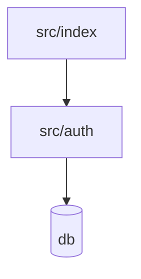

# Understand Codebase (언더스탠드)

프로젝트 전체를 스캔하여 **파일·함수·클래스·의존성**을 지식 그래프로 만들고, 아키텍처 레이어와 가이드 투어를 곁들인 대시보드로 한눈에 보여준다. 처음 보는 코드베이스, 남이 짠 코드, 오픈소스를 빠르게 파악할 때 강력하다.

원본 Understand-Anything는 Tree-sitter(결정론적 구조 추출) + LLM(의미 요약)을 결합한 7단계 파이프라인과 React 대시보드를 가진 무거운 플러그인이다. 이 스킬은 **외부 의존성 없이** 동일한 산출물(지식 그래프 + 대시보드)을 마크다운/Mermaid로 만드는 포터블 버전이다. 풀 인터랙티브 대시보드가 필요하면 원본 플러그인을 설치하라.

## 산출물

`.understand/` 디렉토리에 생성:
- `knowledge-graph.json` — 노드/엣지/레이어/투어를 담은 그래프 데이터
- `DASHBOARD.md` — 사람이 읽는 대시보드(요약 + Mermaid 다이어그램 + 가이드 투어)
- `meta.json` — 분석 시점의 git HEAD, 파일 수 등(증분 갱신용)

## 그래프 스키마

**노드 타입**: `file`, `function`, `class`, `module`, `concept`, `config`, `document`, `service`, `endpoint`, `table`, `schema`, `pipeline`, `resource`
**엣지 타입(예)**: `imports`, `calls`, `extends`, `implements`, `contains`, `depends_on`, `reads`, `writes`, `tested_by`, `routes_to`, `references`

```json
{
  "project": { "name": "...", "root": "...", "commit": "...", "languages": ["..."] },
  "nodes": [ { "id": "src/auth.ts:login", "type": "function", "file": "src/auth.ts",
               "summary": "...", "complexity": 3 } ],
  "edges": [ { "from": "...", "to": "...", "type": "calls", "weight": 1 } ],
  "layers": [ { "name": "Presentation", "nodes": ["..."] } ],
  "tour": [ { "step": 1, "node": "...", "why": "여기서 시작하라" } ]
}
```

## 7단계 파이프라인

진행 상황을 `[Phase N/7] <name>...`로 보고하라.

**Phase 0 — Pre-flight**: `PROJECT_ROOT` 확정(git worktree면 메인 repo 루트로). `.understand/` 생성. `git rev-parse HEAD` 기록. 기존 `meta.json`이 있고 HEAD가 같으면 "최신" 처리, 다르면 변경 파일만 증분 분석.

**Phase 0.5 — Ignore 설정**: `.understandignore`(없으면 `node_modules`, `dist`, `build`, `.git`, 바이너리, 락파일, 벤더 디렉토리 등을 기본 제외)를 확인/생성.

**Phase 1 — SCAN**: 파일 목록·언어·프레임워크를 식별하고 각 파일을 카테고리(`source`/`test`/`config`/`doc`/`asset`)로 분류. 파일이 100개를 넘으면 사용자에게 범위 확인.

**Phase 1.5 — BATCH**: 의미적으로 가까운 파일을 배치로 묶는다(디렉토리/모듈 단위). 큰 코드베이스는 배치 단위로 병렬 분석.

**Phase 2 — ANALYZE**: 배치별로 파일을 읽어 노드(파일/함수/클래스)와 엣지(import/call/extends 등)를 추출한다. 런타임 정책과 사용자가 허용하고 작업 묶음이 서로 독립적일 때만 병렬 에이전트를 사용한다. 결과는 병합·정규화·중복 제거하고, 테스트→대상 `tested_by` 링크를 건다.

**Phase 3 — ASSEMBLE REVIEW**: 병합된 그래프의 dangling 엣지, 누락 노드, ID 충돌을 검수한다.

**Phase 4 — ARCHITECTURE**: 노드를 아키텍처 레이어로 묶는다(예: Presentation / Application / Domain / Infrastructure, 또는 프로젝트에 맞는 레이어). 언어/프레임워크 관례를 반영.

**Phase 5 — TOUR**: 의존성 순서에 따라 "여기서 시작 → 다음은 여기" 가이드 투어를 생성한다(신규 인원 온보딩용).

**Phase 6 — REVIEW**: 그래프 정합성 검증(모든 엣지의 양끝 노드 존재, 고립 노드 점검, 레이어 누락 점검). 통과 시에만 저장.

**Phase 7 — SAVE**: `.understand/knowledge-graph.json`, `DASHBOARD.md`, `meta.json` 저장. 요약 출력.

## DASHBOARD.md 형식

````markdown
# <프로젝트명> — Codebase Dashboard
> 분석 시점: <commit> · 파일 N개 · 언어: ...

## 한눈에 보기
- **무엇인가**: <한 문단 요약>
- **진입점(Entry points)**: <main/index/route 파일들>
- **핵심 모듈 Top 5**: <의존도·복잡도 높은 순>

## 아키텍처 레이어
| 레이어 | 책임 | 핵심 노드 |
|--------|------|-----------|

## 의존성 그래프


## 가이드 투어 (신규 인원용)
1. **`src/index.ts`** — 여기서 시작. 앱 부팅 지점.
2. **`src/auth.ts`** — 인증 흐름. `login()`이 핵심.
...
````

## 옵션
- `[path]` — 분석할 경로(기본: 프로젝트 루트)
- `--full` — 증분 무시하고 전체 재분석
- `--review` — 그래프 검수를 별도 에이전트로 강화
- `--language <lang>` — 출력 언어(기본: 한국어)

## 적용 신호
- "이 프로젝트/레포 구조 파악해줘", "이 오픈소스 분석해줘", 처음 보는 코드베이스 온보딩.
- 분석 후 [[superpowers-workflow]]의 요구사항 정리 단계로 자연스럽게 이어진다(맥락을 먼저 확보).
